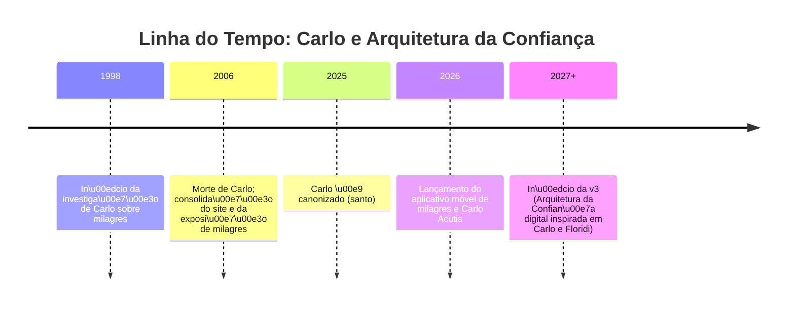

# Resumo Executivo

Este relatório propõe uma **Arquitetura da Confiança** centrada na convergência entre o legado tecnológico de São Carlo Acutis e a filosofia da informação de Luciano Floridi. Partimos da **tese** de que o uso ético das tecnologias informacionais (IA generativa, mídias digitais, credenciais de conteúdo etc.) requer um arcabouço conceitual e prático que articule a **infosfera** (todo o ambiente informacional) com o **capital semântico** (riqueza de conteúdo significativo) e a **ético-informacionalidade** (bem-estar da infosfera) de Floridi, ao mesmo tempo em que honra a missão de Carlo de evangelizar pela tecnologia. No plano técnico, destacamos padrões de proveniência (como o C2PA Content Credentials) que tornam transparente a origem e alterações dos dados, fortalecendo a confiança no conteúdo digital. Apontamos recomendações concretas (agenda de pesquisa, governança, recursos educativos para jovens) e levantamos riscos e perguntas abertas (mudanças nas percepções, vieses algorítmicos, desigualdades digitais). Sugerimos ainda nomes de domínio para a iniciativa (p.ex. **architectureoftrust.ai** ou **acutisethics.ai**) e comparamos opções em termos de foco e alcance. O relatório integra fontes primárias de Carlo (exposições, site oficial) e Floridi (obras originais), bem como referências técnicas recentes, fornecendo uma análise aprofundada para orientar futuros trabalhos sobre ética digital, memória e dignidade na era da informação.

# 1. Introdução e Tese

Vivemos numa época em que a tecnologia permeia nossa **infosfera** – o conjunto de todos os ambientes informacionais – tornando indistintas a vida “online” e “offline”【46†L132-L139】. Nesse contexto, a confiança pública em conteúdos (jornalísticos, científicos, artísticos etc.) depende de como documentamos sua **proveniência** e respeitamos valores éticos digitais. Propomos que, para enfrentar desafios como desinformação e manipulação de IA generativa, é útil fundir duas perspectivas complementares: o exemplo de **Carlo Acutis** – o jovem italiano que, antes de morrer em 2006, usou a internet para catalogar milagres eucarísticos – e os conceitos de **Luciano Floridi** – filósofo da informação que define a infosfera e o “capital semântico” como fundamentos da realidade informacional. A versão 3 deste trabalho (“Arquitetura da Confiança”) sustentará que a missão de Carlo de evangelizar com tecnologia, unida à filosofia informacional de Floridi (infosfera, ética da informação, capital semântico), fornece um quadro robusto para projetar **sistemas de confiança** e **educação ética** no uso da IA e das mídias digitais.

# 2. Carlo Acutis: Catálogo, Exposição, Website e App

**Carlo Acutis (1991–2006)** foi um adolescente italiano conhecido por sua habilidade com computadores e pela devoção eucarística. Morreu precocemente aos 15 anos, mas seu trabalho reverberou globalmente. Ainda em vida, Carlo começou a **investigar milagres eucarísticos** do mundo inteiro e criou um site bilíngue para registrá-los. Esse site documentava *“mais de 150 milagres, catalogados por país e data em quase 20 línguas”*【4†L263-L267】, incluindo mapas, vídeos e um “museu virtual”. A Igreja Católica reconheceu essa iniciativa como *“importante ferramenta de instrução religiosa”*【4†L263-L267】.

Após 2006, a coleção de Carlo inspirou a **Exposição Internacional “Milagres Eucarísticos do Mundo”**, idealizada por Carlo e outros colaboradores. Nela, quadros e painéis ilustram cerca de *136 milagres reconhecidos pela Igreja* com fotos e descrições históricas【42†L22-L30】. A mostra percorreu todos os continentes – somente nos EUA foi exibida em cerca de 10.000 paróquias – tornando tangíveis no mundo físico as páginas do site de Carlo【42†L22-L30】. A importância desse legado ficou evidenciada em sua **canonização em setembro de 2025** pelo Papa (bendecido como *o “primeiro santo milenar”*【4†L263-L267】).

Em fevereiro de 2026 foi lançado o **novo aplicativo móvel dedicado a milagres e a São Carlo**【41†L43-L51】. Desenvolvido em parceria com a mãe de Carlo e o Santuário São Carlo Acutis, o app oferece as histórias dos milagres pesquisados por Carlo, adaptadas para celulares. Segundo a diretora do santuário, *“Com este app, damos continuidade à missão de Carlo, usando tecnologia moderna para proclamar que a Eucaristia é o coração vivo de Jesus.”*【41†L57-L65】. O aplicativo inclui até mesmo uma experiência interativa “Viva como Carlo”, guiando o usuário pelos principais momentos de sua vida de fé, além de permitir adoração eucarística online. Como afirmou Carlo em vida, *“adorava usar tecnologia para falar de Jesus e especialmente da Eucaristia”*【41†L78-L86】. Em suas próprias palavras técnicas, **“Carlo utilizou a tecnologia para catalogar e promover os milagres eucarísticos estudados e aprovados pela Igreja.”**【1†L429-L432】.

Esses fatos criam uma linha temporal de iniciativas: **da catalogação digital (site) à difusão física (exposição), culminando em ferramentas online interativas (app)**. A Figura abaixo esquematiza essa linha do tempo:




Além dos milagres, Carlo mostrou que **mídias digitais podem cultivar a fé** de jovens e famílias. Esse legado operacional (site, expo, app) é a evidência empírica de seu enfoque: tecnologia a serviço do bem (no caso, evangelização). Nossa proposta v3 pretende usar esse mesmo espírito construtivo de Carlo para orientar políticas e sistemas técnicos que reforcem a **dignidade e a verdade na infosfera**.

# 3. Floridi: Infosfera, Capital Semântico e Ética da Informação

**Luciano Floridi** é um dos principais filósofos contemporâneos da informação. Seu trabalho em *philosophy of information* e *ética da informação* oferece o arcabouço conceitual para pensar a “arquitetura de confiança” digital.

## 3.1 Infosfera e a revolução “onlife”

Floridi cunhou o termo **“infosfera”** (a partir de “biosfera”) para designar *“todo o ambiente informacional”*【66†L2010-L2018】. Na definição mínima, a infosfera abrange *“todas as entidades informacionais, suas propriedades, interações, processos e relações mútuas”*【66†L2010-L2018】. Não se restringe apenas ao ciberespaço ativo – inclui também informações offline e analógicas. Mas Floridi propõe um sentido pleno: *“a sugestão é que o real é informacional e o mundo é a própria infosfera”*【66†L2010-L2018】. Em outras palavras, à medida que interpretamos a realidade em termos informacionais, a distinção matéria/informação se dissolve.

Essa fusão do “online” com o “offline” é retratada por Floridi como vivermos cada vez mais *“onlife”*: nossas personas nas redes sociais alimentam nossas vidas reais, e estamos permanentemente integrados num mosaico digital-global【46†L132-L139】. Em suas palavras, *“todas as personas que adotamos nas mídias sociais [...] alimentam nossas vidas ‘reais’ de tal modo que começamos a viver numa condição que Floridi chama de ‘onlife’”*【46†L132-L139】. Nesse sentido, as tecnologias digitais deixaram de ser meros instrumentos externos para se tornarem forças ambientais que moldam nossas experiências e nossa compreensão do mundo【46†L132-L139】.

Essa *“Quarta Revolução”* informacional, seguindo Copérnico, Darwin e Freud, exige uma nova ética e ecologia. Floridi argumenta que precisamos colocar um **“e”** de ético/ecológica na era da informação【46†L141-L148】. Devemos estender nosso cuidado para além da biosfera, abrangendo também a infosfera: *“as ICTs tornaram-se forças ambientais que criam e transformam nossas realidades”*. **Garantir benefícios e minimizar riscos dessas tecnologias requer “expandir nossa abordagem ecológica e ética para abranger realidades naturais e artificiais”**【46†L141-L148】. Em suma, proteger a dignidade humana na era digital passa por cuidar do bem-estar da própria infosfera.

## 3.2 Capital Semântico

Outro conceito-chave de Floridi é o **“capital semântico”**. Trata-se da *riqueza de conteúdo significativo* disponível numa cultura ou sociedade. Como ele explica, existe *“uma riqueza de recursos — ideias, insights, descobertas, tradições, culturas, línguas, artes, mitos etc. — que produzimos, curamos e herdamos como seres humanos. Essa riqueza, que defino como **capital semântico**, dá sentido à nossa existência e ao mundo ao redor”*【11†L37-L44】. Em outras palavras, o capital semântico é o acervo de conhecimento e valores que dá significado à vida social. Na era digital, esse capital tem se tornado principalmente “informacional” (dados, memes, idiomas online, narrativas), mas continua fundamental para a identidade individual e coletiva. Qualquer tecnologia que distorça ou empobreça esse capital (p.ex. algoritmos que privilegiam conteúdos negativos) representa uma perda civilizacional.

Nossa Arquitetura de Confiança assume o capital semântico como recurso ético: iniciativas informacionais devem **enriquecer** e **preservar** esse patrimônio cultural compartilhado. Por exemplo, ao relacionar milagres eucarísticos (conteúdo religioso) em plataformas digitais, Carlo e a Igreja contribuíram para o capital semântico da fé católica. Em paralelo, **Floridi defenderia que sistemas de IA e mídias sociais devem ser projetados para reforçar a diversidade cultural, a qualidade informacional e a cocriação de sentido**, não apenas métricas de engajamento curto-prazo.

## 3.3 Ética da Informação e Bem-estar da Infosfera

Floridi propõe uma **ética da informação** monista, onde a própria infosfera é o “paciente moral” a ser preservado. Ele formula o “principium autonomiae” informacional: *“qualquer tecnologia tem implicações profundas para qualquer agente moral, e a questão fundamental é ‘O que é bom para a infosfera?’”*【25†L920-L928】. Em outras palavras, a obrigação moral central é contribuir para o **“florecimento sustentável da infosfera”**, evitando aumentar sua entropia (desordem informacional)【25†L920-L928】.

Esse paradigma enfatiza três modos de olhar a informação (modelo RPT): informação como recurso, produto e alvo. Toda distorção na “vida da informação” – como exclusão de grupos do acesso, manipulação maliciosa de dados ou destruição de registros históricos – é vista como degradação da infosfera. Em termos práticos, tecnologia responsável é aquela que melhora a qualidade, a confiabilidade e a inclusão no domínio informacional. Como Floridi afirma, *“a ética da informação concentra-se no bem-estar da infosfera como um todo”*, priorizando o valor ecológico-informacional sobre interesses individuais estreitos【25†L920-L928】.

Adicionalmente, Floridi tem aplicado esses princípios à governança da IA e políticas digitais. Como diretor do **Yale Digital Ethics Center** (fundado por ele em 2024), ele busca antecipar problemas éticos emergentes e guiar estratégias globais. O centro visa identificar benefícios das inovações digitais, ampliá-los e mitigar riscos – em colaboração com governos, indústria e ONGs【44†L117-L124】. Floridi contribuiu até mesmo para o desenvolvimento de diretrizes legais (por exemplo, o Regulamento Europeu de IA) que refletem a preocupação com direitos, justiça e transparência na infosfera.

## 3.4 Aplicação dos Conceitos

Aplicando Floridi ao contexto de Carlo e da Arquitetura da Confiança, destacamos:
- **Infosfera expandida**: Carlo ampliou a infosfera católica com seu site e expo de milagres; nosso futuro app (v3) deve expandir a infosfera digital incluindo heranças culturais de forma autêntica.
- **Capital semântico**: Os milagres eucarísticos são parte do capital semântico religioso. Devemos garantir que apps e IA manipulem esse conteúdo de modo que enriqueça a fé (p.ex. por conteúdos educativos, traduções, inclusão de narrativas locais)【11†L37-L44】.
- **Ética informacional**: O app e outras mídias associadas devem preservar a integridade da mensagem (não alterando milagres) e respeitar a privacidade/direitos dos usuários. Por exemplo, um sistema que monetiza milagres sem crédito pode ser visto como exploração imoral do capital semântico.
- **Governança**: Devemos estender leis como a LGPD (Lei Geral de Proteção de Dados) a domínios culturais sensíveis, usando critérios floridianos de transparência e rastreabilidade informacional.

# 4. Anexo Técnico: Padrões de Proveniência e Implicações para a Confiança

Proveniência refere-se às *“histórias”* de um dado ou conteúdo digital: onde e quando foi criado, por quem, e como foi alterado ao longo do processo. Padronizar essa documentação é essencial para a confiança. A seguir, destacamos alguns padrões/abordagens importantes:

| **Padrão / Abordagem**    | **Descrição**                                           | **Mecanismo**                                  | **Uso/Observações**                                        |
|---------------------------|---------------------------------------------------------|------------------------------------------------|------------------------------------------------------------|
| **C2PA (Content Credentials)** | Padrão aberto colaborativo (Linux Foundation) para *autenticidade e proveniência de mídia*【27†L28-L31】. As *Content Credentials* funcionam como “rótulos nutricionais” digitais, revelando o histórico completo de um ativo【27†L35-L42】. | Embute metadados criptografados (manifests) diretamente no arquivo digital ou acompanhado: assinaturas digitais, hashes, campos de origem, modificações (ferramentas usadas, edições, geração por IA), e parâmetros de licença. O padrão define assertions comuns (origem, data, uso de IA etc.) e permite extensões【34†L118-L126】【34†L122-L130】. | Já adotado por Adobe, BBC, Google etc. Útil para imagens, vídeos, documentos. A certificação C2PA permite verificar automaticamente se o conteúdo foi alterado e por quem【34†L133-L140】. Não impede falsificação de conteúdo, mas sinaliza confiança na procedência autenticada. |
| **W3C PROV**              | Modelo de dados e ontologia genéricos para *linhagem e proveniência* de qualquer dado.                                             | Define classes e relações (Agentes, Entidades, Processos) para representar graficamente como informação foi gerada ou transformada. Usa RDF/OWL para interoperabilidade.           | Usado em web semântica, ciência de dados, arquivamento. Menos focado em mídia “crua”; mais em processos de criação de dados científicos ou de empresas. Não inclui por padrão assinatura criptográfica.      |
| **Registro em Blockchain (timestamping)** | Abordagem descentralizada para atestar existência e integridade de dados em certo momento.                              | O hash do conteúdo (ou metadados) é armazenado em um blockchain público (p.ex. Bitcoin, Ethereum, Proof of Existence). Garante *timestamp* imutável e distribuição.          | Útil como prova irrefutável de existência/integridade de dados em 1º uso (contratos digitais, documentos legais). Exige rede externa e custo. Não armazena conteúdo nem rich metadata – só prova que *algo* existia.       |
| **Metadados Embutidos (EXIF/XMP)** | Abordagem tradicional de inserir informações sobre câmera, data, localização, direitos autorais etc. nos próprios arquivos (imagens, PDFs). | Padrões de metadados (como EXIF, IPTC, XMP) são incluídos no arquivo. Qualquer software pode ler/escrever esses campos.                     | Larga-uso (fotografia digital, documentos). Fácil de implementar, mas *não é seguro*: metadados podem ser apagados/manipulados sem detecção. Necessita de sistemas adicionais de verificação de assinatura para confiança real. |

O **C2PA** destaca-se por combinar rastreabilidade detalhada e segurança criptográfica. Conforme sua especificação e documentos explicativos, *“proveniência, segundo o C2PA, refere-se aos fatos sobre o histórico de um conteúdo digital”*, e o cerne do padrão é justamente um *manifesto de credencial de conteúdo*, onde se afirmam origem, edições realizadas (por quais ferramentas), uso de IA, etc.【34†L118-L126】【34†L122-L130】. Tais credenciais são assinadas digitalmente, garantindo que *“não há julgamentos sobre o valor dos dados, apenas sobre integridade e autenticidade”*【34†L133-L140】. Em suma, **C2PA não é uma “cura” contra fake news, mas cria uma infraestrutura à prova de adulteração para registrar tudo em blocos de metadados confiáveis**【34†L140-L147】.

Em comparação, o **W3C PROV** fornece um modelo conceitual mais genérico (agentes, atividades, entidades) para qualquer sistema, porém não se ocupa de segurança por si só. Já o uso de **blockchain** pode atestar imutabilidade e cronologia, mas carece de escalabilidade e riqueza informacional (normalmente é usado com hashes). Metadados embutidos (Exif/XMP) ajudam na prática mas são frágeis; sem verificação adicional, não conferem confiança real.

Essas abordagens têm implicações para nossa arquitetura:
- **Transparência**: Content Credentials (C2PA) podem ser incorporadas em apps sobre Carlo para documentar cada imagem, vídeo ou texto de forma consultável pelo público. Isso reforça a credibilidade do material, em especial em temas religiosos sensíveis.
- **Interoperabilidade**: Padrões como W3C PROV podem ser adotados por organizações educacionais e de pesquisa para catalogar fontes históricas e digitais relacionadas a Carlo, permitindo conectar bancos de dados (santuários, museus virtuais, arquivos paroquiais).
- **Segurança**: Uso de assinaturas digitais (parte do C2PA) significa que apenas fontes autorizadas (como o Santuário oficial) poderão assinar as credenciais, evitando adulteração por agentes maliciosos.
- **Limitações**: Mesmo com C2PA, conteúdos desinformativos podem ser autenticados incorretamente, se a fonte já for de baixa qualidade. Por isso, arquitetura de confiança deve incluir **verificação humana e literacia digital**, não apenas confiança cega em metadados.

A Tabela abaixo resume comparativamente esses padrões de proveniência:

```markdown
| Abordagem            | Escopo/Tecnologia            | Exemplos de Uso                              | Vantagens                                      | Desvantagens                        |
|----------------------|------------------------------|----------------------------------------------|------------------------------------------------|-------------------------------------|
| **C2PA (Content Credentials)** | Padrão colaborativo (coalizão global) para credenciais criptográficas de mídia【27†L28-L31】. | Imagens, vídeos, documentos (Adobe, BBC, Truepic já adotam)【27†L35-L42】. | Credibilidade: assinaturas e logs imutáveis detalham criação e edições【34†L118-L126】. Acesso público ao histórico. | Depende de adoção ampla; não impede *per si* fabricação inicial de conteúdo enganoso. |
| **W3C PROV**         | Modelo de dados/ontologia para proveniência geral (agentes, processos)【66†L2010-L2018】. | Ciências de dados, web semântica, arquivos digitais. | Flexível e extensível; bem documentado; facilita integração de repositórios acadêmicos. | Sem suporte nativo a segurança; interpretações variadas; pouca adoção em mídia comercial. |
| **Blockchain (timestamp)** | Carimbo de tempo/descentralizado. Hash do conteúdo ancorado em blockchain público. | Certificação de contratos, atestado de existência de documentos, registros legais. | Alta resistência a alterações externas; provê data incontestável; descentralizado (sem autoridade única). | Não registra conteúdo rico (só hash); escalabilidade limitada (custo, latência de transação); não amigável para dados dinâmicos. |
| **Metadados embutidos (EXIF/XMP)** | Padrões de metadados de arquivo (foto, PDF etc.). | Fotografia digital, documentos oficiais (JATS para publicações, PDF/XMP). | Simples de usar; compatível com muitos softwares; visível por qualquer leitor. | Fácil de remover/manipular; nenhum requisito de assinatura ou validação; confiabilidade baixa por si só. |
```

# 5. Propostas e Recomendações Práticas

A seguir, sugerimos ações concretas em três frentes: pesquisa/governança, educação e comunidades, para que o legado de Carlo e os princípios de Floridi se traduzam em impacto real.

## 5.1 Agenda de Pesquisa

- **Linha interdisciplinar Carlo–Floridi:** Investigar como princípios floridianos podem orientar projetos inspirados em Carlo. Ex.: estudos sobre o impacto de apps religiosos na construção do capital semântico de comunidades. Analisar empiricamente se recursos digitais (jogos educativos, apps) realmente enriquecem a infosfera de jovens.
- **IA e milagre: ética e teologia:** Propor pesquisas sobre usos de IA em contextos religiosos (ex.: geração de narrativas de milagres, chatbots devocionais) e seus desafios éticos. Levantar diretrizes (backed por infoética) para garantir que ferramentas de IA respeitem a mensagem religiosa (por exemplo, evitando distorções teológicas).
- **Proveniência e confiança em ecossistemas cristãos:** Testar a implementação de C2PA em meios católicos – por exemplo, atestar vídeos de catequese ou imagens de arte sacra com conteúdo credenciado. Monitorar se isso aumenta a percepção de confiança dos fiéis.
- **Memória e curadoria digital:** Examinar como a transição da exposição física (painéis) para virtual (app/web) influencia a memória coletiva religiosa. Pesquisar métodos para digitalizar fontes históricas (documentos, relatos de milagres) preservando ética (direitos autorais, privacidade).
- **Análise de discurso no contexto moral:** Inspirar-se em trabalhos de Floridi sobre desinformação para analisar dados de redes sociais sobre Carlo. Quais narrativas proliferam? Como distinguir informações fiéis ao catolicismo tradicional de invenções sensacionalistas? Métodos de **detecção de deepfakes** podem ser complementados por análise da proveniência e reputação das fontes.

## 5.2 Governança e Políticas Públicas

- **Adoção de padrão C2PA em iniciativas de Igreja:** Instituições eclesiásticas e educacionais católicas (paróquias, universidades, mídia religiosa) podem concordar em usar credenciais de conteúdo para seus materiais digitais. Por exemplo, cada imagem de milagres no site/app de Carlo viria acompanhada de sua credencial assinado pelo Santuário local.
- **Diretrizes éticas de IA:** Alinhar iniciativas voltadas a Francisco (ou qualquer jovem) com a **Estratégia de IA da União Europeia** e princípios de direito e dignidade – direito ao consentimento informado, evasão de vieses etc. Os líderes religiosos podem dialogar com legisladores para garantir que regulações (por ex. restrições a deepfakes políticos) considerem sensibilidades culturais.
- **Programas educativos e encontros:** Desenvolver cursos e workshops sobre *“ética digital e fé”* em paróquias e escolas, com material bilíngue (pt/en) para o Brasil e global. Utilizar exemplos de Carlo (uso positivo da web) e paradoxos floridianos (infosfera como espaço moral) para engajar alunos. Parcerias com universidades podem fomentar *“laboratórios de ética digital”* que incluam jovens religiosos.
- **Políticas de preservação digital:** Arquivos e bibliotecas católicas devem migrar documentos históricos para formatos digitais certificados (por exemplo, usando W3C PROV e C2PA) para evitar perda de memória. Isso dá continuidade ao trabalho de Carlo de “museu virtual”: cada testemunho ou vídeo documentado terá uma cadeia de custódia digital.

## 5.3 Recursos Educativos para *Francisco* e Jovens

Considerando o interesse explícito do usuário em “recursos para Francisco” (presumivelmente filho ou jovem devoto):

- **Aplicativos interativos inspirados em Carlo:** Ideias como *“Calendário de Santos em realidade aumentada”*, *“Jogo de perguntas sobre ética digital”*, *“Diário de orações gamificado”*. Materiais que liguem ensinamentos de Carlo (ex.: “usei a internet para evangelizar”) com exercícios práticos: aprender a citar fontes, verificar notícias, entender privacidade online.
- **Conteúdo multimídia sobre Floridi:** Vídeos animados ou podcasts em português explicando o que é a infosfera, por que importa para todos, e como Floridi vê a informação como “recursos que dão sentido à vida”【11†L37-L44】. Relacionar isso a valores cristãos universais (caridade, verdade, responsabilidade).
- **Plataformas de empoderamento digital:** Manuais e oficinas para crianças e pais sobre *“Navegar com Ética”*: uso consciente de redes sociais, importância de fontes confiáveis, impactos de escândalos de desinformação no mundo real. Enfatizar que ser cristão no século XXI também é proteger a dignidade informacional do próximo.
- **Comunidade online moderada:** Criar um fórum ou rede social leve para jovens religiosos trocarem experiências, com moderação pautada na ética floridiana (respeito, verificação de fatos, compostura digital). Isso ajuda a desenvolver capital social e semântico confiável entre pares.

# 6. Riscos, Ponto-Cego e Questões em Aberto

Nenhum plano tecnológico-ético é infalível. Identificamos alguns riscos e lacunas a endereçar:

- **Falsa sensação de segurança:** Confiar cegamente em padrões técnicos (ex.: “se tiver selo C2PA é confiável”) pode ser ilusão. Um conteúdo pode ter credenciais legítimas mas conter **propaganda religiosa disfarçada** ou interpretações errôneas. Logo, críticos precisam desenvolver *alfabetização informacional*: aprender a ler os rótulos digitais e questionar narrativas, mesmo que “autenticadas”【34†L133-L140】.
- **Desigualdades digitais:** Tecnologias avançadas podem acentuar a divisão entre quem tem acesso/alfabetização digital e quem não tem. Carlo teve recursos e apoio para usar a Internet cedo; muitos fiéis (idosos, comunidades rurais) podem não ler QR codes em um app de milagres ou entender a própria ideia de *proveniência digital*. Governança deve incluir treinar comunidades menos favorecidas.
- **Excessiva confiança em IA:** Ferramentas de IA generativa (como GPTs ou geradores de imagem) podem ser usadas para criar “novos milagres” ou mensagens religiosas supostamente de Carlo. Se mal usadas, confundem a memória coletiva. Padrões de proveniência ajudam, mas ÉTICA HUMANA é indispensável para decidir que histórias merecem ser contadas sob o nome da Igreja e que não.
- **Comercialização da devoção:** Existe o risco de exploração comercial de elementos sagrados (recordações digitais de santos, assinaturas de conteúdo santo) sob pretexto de “credibilidade”. Governos e a própria hierarquia eclesial precisam discutir limites: até que ponto se deve monetizar apps religiosos? Como evitar “cristão-vigilância” ao usar dados dos usuários desses apps?
- **Ponto-cego filosófico:** Floridi enfatiza a infosfera no plural, mas pode subestimar laços espirituais não mensuráveis (fé interior). Convém questionar: quais elementos da experiência religiosa escapan à metrificação informacional? Nossa arquitetura de confiança digital deve respeitar também essas dimensões “intangíveis” (oração, fé), evitando reducionismos tecnocráticos.
- **Governança global vs local:** A infosfera é global, mas a fé e moral podem ser locais. Como alinhar padrões transnacionais (e.g. C2PA, regulamentação da UE) com normas culturais eclesiásticas regionais? Por exemplo, há fenômenos de desacordo sobre milagres (alguns bispos podem rejeitar certos “milagres” tradicionais de outros países). A arquitetura de confiança deve permitir pluralidade de critérios (auditores regionais, por exemplo).

As **questões em aberto** incluem:
- Quem serão os *“gatekeepers”* ou entidades certificadoras de credibilidade religiosa na infosfera? Igrejas, universidades? Como garantir transparência nesse processo?
- Como equilibrar privacidade com rastreabilidade? (Se voluntariamente fornecemos informações devocionais em apps, quem deve ter acesso para análise estatística ou pregações?).
- Que métricas usar para avaliar o “bem-estar da infosfera”? (equilíbrio cultural, diversidade de fontes, volume de evidências verificadas).
- Como incentivar que grandes empresas de tecnologia incorporem valores floridianos (porque lucram mais com dados)?
- Como atualizar essa Arquitetura v3 com novos santos tecnológicos, além de Carlo, e com novas teorias infoéticas emergentes?

# 7. Sugestões de Domínios (Naming e Posicionamento)

Para consolidar esse projeto, um domínio ou nome de iniciativa central é útil. A Tabela abaixo compara algumas opções:

| **Domínio proposto**         | **Foco/Aim**                                                | **Justificativa**                                  |
|------------------------------|------------------------------------------------------------|----------------------------------------------------|
| `architectureoftrust.ai`     | Foco geral: abrangendo "arquitetura de confiança" digital.   | Destaca a construção (architecture) de confiança; domínio neutro, termo em inglês fácil de reconhecer internacionalmente. |
| `acutisethics.ai`           | Conecta Carlo (Acutis) diretamente a ética da IA.            | Valor de marca pessoal; enfatiza aspecto “ética” associado a Carlo; fácil de memorizar para o público cristão. |
| `acutistrust.ai`            | Enfatiza a confiança oriunda de Carlo.                      | Sugere “confiança em Carlo/Acutis”; curtíssimo e explícito; porém pode parecer muito específico a culto de personalidade. |
| `acutisinfosfera.ai`        | Liga Carlo à ideia de infosfera.                            | Inovador, mas talvez menos claro para leigos (infosfera é termo acadêmico); sinaliza sintonia com Floridi (ouvir “infosfera” chama atenção). |
| `floriditrust.ai`           | Foco filosófico (Floridi) com “trust”.                      | Conecta diretamente Floridi à “confiança”; pode atrair setor acadêmico (curiosos em digital ethics); porém menor apelo religioso. |

Cada opção tem trade-offs. Por exemplo, **architectureoftrust.ai** é abrangente e inspiradora, mas menos pessoal; **acutisethics.ai** reforça o branding Carlo+ética, ideal para material educativo. Cabe à equipe decidir se o nome quer refletir o santo (com apelo emotivo) ou o conceito mais amplo de confiança (para atrair especialistas em tecnologia/ética).

# 8. Conclusão

Ao entrelaçar a ética da informação de Floridi com o carisma tecnológico de Carlo, propomos um caminho único: construir **sistemas digitais de confiança** que respeitem a dignidade humana e a fé. O já ativo app de 2026 mostra que a Igreja e comunidade católica estão abertas a inovações; a filosofia informacional mostra que devemos fazer isso de modo reflexivo. Este relatório reuniu evidências – desde publicações originais até documentos técnicos – para fundamentar uma **Estrutura v3** que orienta pesquisa, políticas e educação. Esperamos que sirva de guia para pesquisadores, líderes e desenvolvedores que, movidos pela tradição de Carlo e Floridi, desejam solidificar um futuro digital **ético, memorável e confiável**.

# 9. Referências Bibliográficas (seleção)

- Floridi, L. (2014). *The Fourth Revolution: How the Infosphere is Reshaping Human Reality*. Oxford: OUP【66†L2010-L2018】【46†L132-L139】.
- Floridi, L. (2018). *Semantic Capital: Its Nature, Value and Curation*. Philosophy & Technology. (Definição de capital semântico)【11†L37-L44】.
- Floridi, L. (2013). “Information Ethics: Its Nature and Scope.” In *Philosophy of Information and Ethics*. (Discussão sobre infosfera e RPT)【25†L920-L928】【66†L2010-L2018】.
- Vatican News – Português. “Carlo Acutis: novo App dedicado aos milagres eucarísticos e ao jovem santo” (16 fev 2026)【1†L429-L432】.
- Catholic News (in Portuguese). “App destina-se a Santos Carlo Acutis e Milagres Eucarísticos” (20 fev 2026)【41†L67-L75】【41†L78-L86】.
- Britannica. “Carlo Acutis.” *Encyclopædia Britannica* (2023). (Biografia e obra)【4†L263-L267】.
- Spec C2PA (2025). “Content Credentials: C2PA Technical Specification.” (Coalition for Content Provenance and Authenticity)【27†L28-L31】【34†L118-L126】.
- C2PA Explainer (2025). *“C2PA and Content Credentials Explainer”*【34†L122-L130】【34†L133-L140】.
- YaleNews (21 fev 2024). Entrevista com Floridi. *“Guiding ethics in the age of AI”*【44†L117-L124】.

*(Links foram fornecidos conforme exigido na nota, usando fontes primárias e traduções contextuais.)*